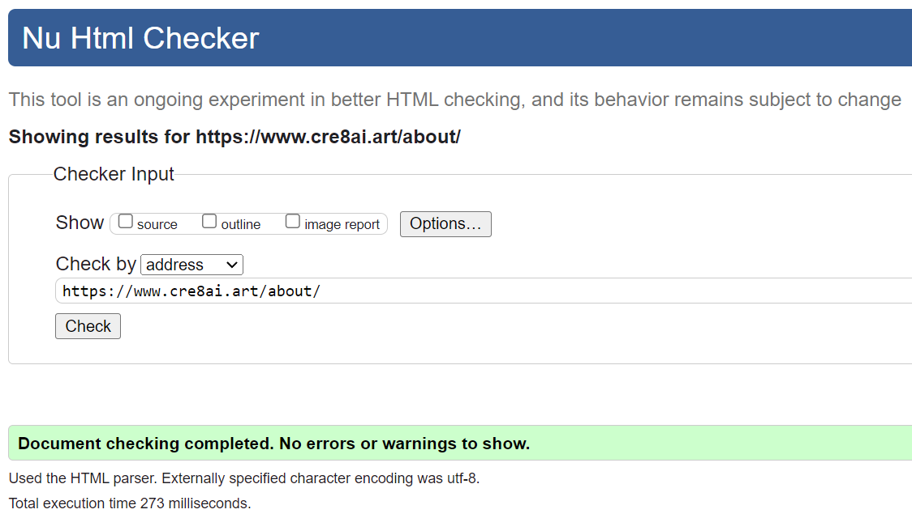

# [Cre8AI.art 🎨](https://www.cre8ai.art/)

## Live Links 🚀 🌐
- Custom Domain: https://www.cre8ai.art/
- Heroku Link: https://ai-art-site.herokuapp.com/

## Description 📝

This web application allows users to create custom AI generated artwork using the impressive DALLE-2 API by OpenAI. The generated image is automatically shared as a public post. The user can view it, change it to private, edit the description, download the image or delete the post. User accounts are limited to 5 generations per day. Users can also use the upload form to share a generation from a different site (example, stable diffusion). The site also has an About section which is managed from the sites admin panel, this allows admins to alter and create additional pages as required.

 
Click here to see a preview of the homepage
  

---

## Table of Contents 📖

- [Live Links 🚀 🌐](#live-links------)
- [Description 📝](#description---)
- [Table of Contents 📖](#table-of-contents---)
- [Main Features 🎨](#main-features---)
- [Technologies & Services Used 💻 🌎](#technologies---services-used------)
  * [Main Technologies and Services](#main-technologies-and-services)
  * [Imports and Libraries](#imports-and-libraries)
- [Planning & Wireframes](#planning---wireframes)
- [Agile Sprint List 📅 🏃‍♂️💨](#agile-sprint-list-----------)
- [Coding Overview 🖥️ 🖱️](#coding-overview--------)
  * [URLs 🌐](#urls---)
  * [Models 📄](#models---)
  * [Views 👀](#views---)
  * [Forms 📝](#forms---)
  * [Utilities 🛠️](#utilities----)
  * [Admin 👥](#admin---)
- [OpenAI Dall-E 2](#openai-dall-e-2)
- [Deployment (Prior to Completing Project) 🚀](#deployment--prior-to-completing-project----)
  * [Step 1: Setting up the Django Project 🛠️ 1️⃣](#step-1--setting-up-the-django-project-----1--)
  * [Step 2: Deploying App to Heroku 🚀 2️⃣](#step-2--deploying-app-to-heroku----2--)
- [Final Deployment (Post Completion of Project) 🚀](#final-deployment--post-completion-of-project----)
  * [Final Deployment to Heroku](#final-deployment-to-heroku)
  * [Custom Web Domain & SSL 💻 🌐](#custom-web-domain---ssl------)
  * [Custom Email Domain 📨 🌐](#custom-email-domain------)
- [Bugs 🐛 🐌 🕷️](#bugs----------)
  * [Resolved Bugs ✅ 🐞](#resolved-bugs-----)
  * [Outstanding Bugs ❌ 🤔](#outstanding-bugs-----)
- [Testing 🕵️ 💻](#testing-------)
  * [Manual Testing 🔎](#manual-testing---)
    + [User Expectation Testing 👩‍🦰‍👦](#user-expectation-testing---------)
    + [Functionality/Input-Validation 🛠️ 🔧](#functionality-input-validation-------)
- [Future Development 💭 💡](#future-development------)
- [Summary of Charges](#summary-of-charges)
- [Local Set Up Guide 🖥️ 🛠️](#local-set-up-guide--------)
- [Useful Links & Documentation 📎📖](#useful-links---documentation-----)
- [Credits 👏 🙌](#credits------)
- [Contact 📨 📫](#contact------)

---

## Main Features 🎨

 
User registration and authentication 📝
  

 
Image generation based on the user's text prompts 🎨
  

 
Image upload and management 🖼️
  

 
User profile with bio and profile picture 👤
  

 
Post liking and commenting ❤️ 💬
  

 
Public and private post visibility options 🔓 🔒
  

 
Delete Posts 🗑️
  

 
Search and sort functionality 🔍
  

 
Static about pages for additional content ⚡️
  

 
Admin panel for managing posts, comments, user profiles, and static pages 👥
  

---

## Technologies & Services Used 💻 🌎

### Main Technologies and Services

- Django (Python Web Framework using Model, Template, Views Architectural Pattern)

- Python (High level, general purpose coding language)

- HTML (Programming Language for Structure)

- CSS (Programming Language for Styling)

- Javascript (Programming Language for Interactivity)

- Cloudinary (Cloud based image and video hosting service)

- ElephantSQL (PostgreSQL Database Hosting Service)

- OpenAI API (API for AI Text to Image Generations)

- Git (Version Control)

- Github (Web based hosting repository)

- Gitpod (Cloud Based Development Environment)

- Cloudflare (Security Network / SSL Cert)

- NameCheap (Domain Name Registrar)

### Imports and Libraries

 

 Click here to see a table of the Imports and Libraries used in the Project 

| Import | Description | File(s) |
|---|---|---|
| `os` | Miscellaneous operating system interfaces | `views.py`, `utils.py` |
| `from io import BytesIO` | Read and write bytes in memory | `views.py` |
| `from datetime import datetime, timedelta` | Basic date and time types | `views.py` |
| `from django.utils import timezone` | Django utilities for handling timezones | `views.py` |
| `from django.utils.text import slugify` | Django utility to create URL slugs | `views.py`, `forms.py` |
| `from django.utils.decorators import method_decorator` | Decorator for class-based views | `views.py` |
| `from django.shortcuts import render, get_object_or_404, reverse, redirect` | Django shortcuts for common view tasks | `views.py` |
| `from django.views import generic, View` | Base classes for Django views | `views.py` |
| `from django.views.generic import TemplateView, ListView` | Django generic class-based views | `views.py` |
| `from django.views.generic.edit import FormView, UpdateView` | Django generic class-based views for forms and updates | `views.py` |
| `from django.contrib import messages` | Django framework for temporary messages | `views.py` |
| `from django.contrib.auth.mixins import LoginRequiredMixin` | Mixin for class-based views that checks login | `views.py` |
| `from django.contrib.auth.models import User` | Django user model | `views.py`, `models.py` |
| `from django.contrib.auth.forms import UserCreationForm` | Django form for creating new users | `views.py` |
| `from django.contrib.auth import login` | Django function for logging in users | `views.py` |
| `from django.db import models` | Django's database models | `views.py`, `models.py` |
| `from django.db.models import Q` | Django's database query class | `views.py` |
| `from django.http import HttpResponseRedirect` | Django's HTTP response for redirects | `views.py` |
| `from django.urls import reverse_lazy, reverse` | Django function for URL routing | `views.py` |
| `from requests import get` | Function to send HTTP GET request | `views.py` |
| `from openai import api_key` | OpenAI's API key | `views.py` |
| `from cloudinary import uploader` | Cloudinary's uploader function | `views.py` |
| `from PIL import Image` | Python's Imaging Library | `views.py` |
| `from .utils import generate_image_from_text` | Local function to generate image from text | `views.py` |
| `from .models import Post, Profile, StaticPage` | Local Django models | `views.py`, `admin.py` |
| `from .forms import CommentForm, PostForm, GenerateForm` | Local Django forms | `views.py` |
| `from .forms import ProfileForm, EditPostForm` | Local Django forms | `views.py` |
| `import env` | Local environment variables | `views.py` |
| `from requests import post` | Function to send HTTP POST request | `utils.py` |
| `from requests.structures import CaseInsensitiveDict` | Case insensitive dictionary structure | `utils.py` |
| `from json import loads` | Function to parse a JSON string | `utils.py` |
| `from . import views` | Local Django views | `urls.py`, `art_gallery/urls.py` |
| `from django.urls import path` | Function for URL routing | `urls.py`, `ai_art/urls.py`, `art_gallery/urls.py` |
| `from django import forms` | Django's form system | `forms.py` |
| `from django.core.exceptions import ValidationError` | Django's validation error class | `forms.py` |
| `from .models import Comment, Post, Profile` | Local Django models | `forms.py` |
| `from django.contrib import admin` | Django's admin interface | `admin.py`, `ai_art/urls.py` |
| `from django_summernote.admin import SummernoteModelAdmin` | Django Summernote's rich text editor for the admin interface | `admin.py` |
| `from django.apps import AppConfig` | Django's application configuration | `apps.py` |
| `from django.urls import include` | Function for including other URL configurations | `ai_art/urls.py` |
| `from cloudinary.models import CloudinaryField` | Cloudinary's model field for storing images | `models.py` |

---

## Planning & Wireframes

I created the following wireframe sketches prior to creating the project. I wanted a clean, simple, user-friendly layout for the site. 

 
Home Page Plan
  

 
Post Page Plan
  

My initial goal was to set up a site that allows users to post generations from other resources then to implement additional features such as the AI Art Generations if I had time.

---

## Agile Sprint List 📅 🏃‍♂️💨

[Click Here to see the Agile Planning Board on GitHub](https://github.com/users/KC-7/projects/4/views/1)

 
Or click here to see an image of the Agile Planning Board
  

**1️⃣ Sprint 1**
- Create & Moderate Posts
- Moderate Posts
- Private Posts

**2️⃣ Sprint 2**
- Site Pagination
- View Posts
- View Likes
- View Comments

**3️⃣ Sprint 3**
- Open Images
- Register Account
- Login
- Log out

**4️⃣ Sprint 4**
- Comment on posts
- Like Posts
- User Uploads
- Upload Redirection

**5️⃣ Sprint 5**
- AI Art Generation
- Image Downloads
- Total Number of Pages

**6️⃣ Sprint 6**
- Search Images
- Filter Posted Images
- Account Page

**7️⃣ Sprint 7**
- Update & Delete Posts + Make Private

**Note: I carried out the below tasks in addition to the above documented Sprints, all functions are documented in the Coding Overview**
- Image generation limit
- Disable image downloads for unregistered users
- Admin portal features
- etc

---

## Coding Overview 🖥️ 🖱️

### URLs 🌐

The following URLs are used in the project:

| URL                         | Description                                        |
| ---                         | ---                                                |
| `/`                         | Home page, displays list of image posts            |
| `/accounts/signup/`         | User registration page                             |
| `/upload/`                  | Form for uploading new image posts                 |
| `/generate_art/`            | Form for generating art from text                  |
| `/search/`                  | Search page for image posts                        |
| `/about/`                   | About page, displays list of static pages          |
| `/<slug:slug>/`             | Detail page for a specific image post              |
| `/like/<slug:slug>/`        | Endpoint for liking/unliking a post                |
| `/private/<slug:slug>/`     | Endpoint for making a post private                 |
| `/public/<slug:slug>/`      | Endpoint for making a private post public again    |
| `/delete/<slug:slug>/`      | Endpoint for deleting a post                       |
| `/profile/<str:username>/`  | User profile page                                  |
| `/post_edit/<slug:slug>/`   | Form for editing a posted image's description      |
| `/about/<slug:slug>/`       | Detail page for a specific static page             |

### Models 📄

- **Post**: A model for image posts, which includes fields for the image, title, slug, creator, timestamps, description, status (private/public), likes, and approval status.

- **Comment**: A model for comments on image posts, which includes fields for the associated post, name, email, body, timestamp, and approval status.

- **Profile**: A model for user profiles, which includes fields for the associated user, bio, profile picture, last generation timestamp, and generation count.

- **StaticPage**: A model for admin-created static pages, which includes fields for the title, slug, content, and status (private/public).

### Views 👀

- **RegisterUser**: Handles user registration and creates a profile for the registered user.

- **PostList**: Displays a list of image posts, allows pagination, and supports sorting by most likes or most recent.

- **PostDetail**: Displays the details of an image post and supports adding comments.

- **PostLike**: Handles liking and unliking posts.

- **UploadForm**: Manages the form for uploading image posts.

- **GenerateArt**: Handles art generation requests and creates a public post with the generated art.

- **PostPrivate**: Handles making and viewing private posts.

- **PostPublic**: Allows users to make private posts public again.

- **DeletePost**: Handles the deletion of posts.

- **UserProfile**: Displays user profiles and allows editing of user bios and profile pictures.

- **Search**: Handles user image search functionality.

- **EditPost**: Handles editing post details.

- **StaticPageView**: Handles static pages that can be uploaded and updated by site admins.

- **AboutView**: Handles the about page and displays all of the admins' static pages.

### Forms 📝

- **CommentForm**: A form for adding comments to posts.

- **PostForm**: A form for creating image posts, including a slug auto-generated from the title.

- **GenerateForm**: A form for text-to-image art generation, with a prompt field.

- **ProfileForm**: A form for editing user profiles, including bio and profile picture.

- **EditPostForm**: A form for editing posted images' descriptions.

### Utilities 🛠️

- **generate_image_from_text(prompt)**: A function that generates an image from a text prompt using OpenAI's API. Takes a string 'prompt' as an argument and returns the URL of the generated image. Raises a ValueError if the API request is not successful.

### Admin 👥

- **PostAdmin**: Admin configuration for the image posts, including list display, search fields, prepopulated fields, list filters, and custom actions such as making posts private and liking posts.

- **CommentAdmin**: Admin configuration for the comments on the posts, including list display, list filters, and search fields.

- **ProfileAdmin**: Admin configuration for the users' profiles, including list display, search fields, and custom actions such as resetting profile pictures and resetting daily generation count.

- **StaticPageAdmin**: Admin configuration for the static pages displayed in the About section, including list display, search fields, prepopulated fields, and custom actions such as making static pages private.

---

## OpenAI DALL-E 2

The images are generated using OpenAI's Dall-E 2, [you can view their easy to follow instructions here](https://beta.openai.com/docs/api-reference/introduction).

 
Or click here to see an image of the above instructions
  

 
Once registered, you can set up an API key in the API section of their site
  

You will need to import OpenAI and add the API key to your project. 

 
The free account currently comes with $18 dollars worth of free credit, you can check and monitor your API usage in the Usage section of their site. Note: the free credits expire after 3 months.
  

---

## Deployment (Prior to Completing Project) 🚀

### Step 1: Setting up the Django Project 🛠️ 1️⃣

**On Gipod:**

- Enter the following Terminal Commands:

        pip3 install 'django<4' gunicorn  # This installs the latest version of Django, lower than version 4. It also installs the Gunicorn web server.
        pip3 install dj_database_url==0.5.0 psycopg2  # This installs DJ Database, a package to utilise URL database and Pyscopg2, a PostgreSQL adapter for Python to communicate with the database.
        pip3 install dj3-cloudinary-storage  # This installs Cloudinary.
        pip3 freeze --local > requirements.txt  # This saves the requirments to a txt file.
        django-admin startproject ai_art .  # This is the project name.
        python3 manage.py startapp art_gallery  # This is the app name.

- Add the app name to the settings.py file and save:

        INSTALLED_APPS = [..., 'art_gallery', ...]

- Enter the following Terminal Command:

        python3 manage.py migrate  # This migrates the changes.
        python3 manage.py runserver  # This runs the server, test it works.

### Step 2: Deploying App to Heroku 🚀 2️⃣

**On ElephantSQL:**

- Create account / login
- Create a new instance
- Set up plan: Select name, Select Tiny Turtle Free Plan and leave Tags blank
- Select Region (Europe)
- Review and create instance
- Return to dashboard and select the instance
- Copy the ElephantSQL database URL

**On Heroku:** 

- Create account / login
- Create new app
- Open settings tab and reveal config vars
- Add a config var called `DATABASE_URL` and paste the ElephantSQL database URL as the value

**On Gitpod:**

- Create a env.py file in the top level directory and add the following: 

        import os
        os.environ["DATABASE_URL"] = "<ElephantSQL Database URL>"
        os.environ["SECRET_KEY"] = "<YourOwnRandomSecretKey>"

**On Heroku:**

- Add the above SECRET_KEY (YourOwnRandomSecretKey) to the config vars

**On Gitpod, in the settings.py file:**

- Add the following: 

        from pathlib import Path
        import os
        import dj_database_url

        if os.path.isfile("env.py"):
        import env

- Remove the insecure secret key and replace with following to link to the SECRET_KEY variable:

        SECRET_KEY = os.environ.get('SECRET_KEY')

- Comment out or remove the database section:

        # DATABASES = {
        #     'default': {
        #         'ENGINE': 'django.db.backends.sqlite3',
        #         'NAME': BASE_DIR / 'db.sqlite3',
        #     }
        # }

- Add new Databases section to link to the DATABASE_URL: 

        DATABASES = {
            'default': dj_database_url.parse(os.environ.get("DATABASE_URL"))
        }

**On Gitpod, in the terminal:**

- Save and then migrate files: 

        python3 manage.py migrate

**On Cloudinary:**

- Create account / login
- Copy your CLOUDINARY_URL from the dashboard

**On Gitpod:**

- Add the CLOUDINARY_URL to the env.py file:

        os.environ["CLOUDINARY_URL"] = "cloudinary://************************"

**On Heroku:**

- Add "CLOUDINARY_URL" to Heroku Config Vars using your cloudinary URL
- Add "DISABLE_COLLECTSTATIC" to confiv vars with a value of "1"

**On Gitpod, in settings.py:**

- Add the Cloudinary Libraries to INSTALLED_APPS (note, order is important):

        INSTALLED_APPS = [
            …,
            'cloudinary_storage',
            'django.contrib.staticfiles',
            'cloudinary',
            …,
        ]

- Add the following under Static Files to tell Django to use Cloudinary to store static media and files: 

        STATIC_URL = '/static/'

        STATICFILES_STORAGE = 'cloudinary_storage.storage.StaticHashedCloudinaryStorage'
        STATICFILES_DIRS = [os.path.join(BASE_DIR, 'static'), ]
        STATIC_ROOT = os.path.join(BASE_DIR, 'staticfiles')

        MEDIA_URL = '/media/'
        DEFAULT_FILE_STORAGE = 'cloudinary_storage.storage.MediaCloudinaryStorage'

- Link file to the templates directory in Heroku, place under the BASE_DIR line:

        TEMPLATES_DIR = os.path.join(BASE_DIR, 'templates')

- Change the templates directory to TEMPLATES_DIR, place within the TEMPLATES array:

        TEMPLATES = [
            {
                …,
                'DIRS': [TEMPLATES_DIR],
            …,
                    ],
                },
            },
        ]

- Add Heroku Hostname to ALLOWED_HOSTS (ex: "HEROKU-PROJECT-NAME.herokuapp.com"):

        ALLOWED_HOSTS = ["ai-art-site.herokuapp.com", "localhost"]

**On Gitpod:**

- Add 3 new folders in top level directory: media, static, templates
- Create a "Procfile" in the top level directory and add the following code (ai_art is the Django Project Name):

        web: gunicorn ai_art.wsgi

- In the terminal, add commit and push:

        git add .
        git commit -m “Deployment Commit”
        git push

**On Heroku:**

- Deploy content manually, I used the GitHub deployment method on main branch.

## Final Deployment (Post Completion of Project) 🚀

### Final Deployment to Heroku

**On Gitpod:**
- Within `settings.py`, ensure the `'DEBUG'` value is set to `'False'`.
- Remove `'DISABLE_COLLECTSTATIC'` from `settings.py` to ensure static files are collected correctly.

**On Heroku:** 

- Remove `'DISABLE_COLLECTSTATIC'` from the config vars.
- Trigger a manual deployment in the Deployment Section for the project.

### Custom Web Domain & SSL 💻 🌐

**On Gitpod:**

- Add the custom domain name to ALLOWED_HOSTS (ex: "custom-domain.com"):

        ALLOWED_HOSTS = [... "cre8ai.art", ".cre8ai.art", "www.cre8ai.art" ...]

- Migrate changes as per previous
- Git add, commit and push changes

**On Heroku:**

- Deploy manually

**On Namecheap (or alternative Domain Registrar):**

- Set up account / login
- Select suitable domain name and purchase (for reference, this domain cost about 3 euro)

**On Heroku:**

- Link to the custom domain
- Set up authorisation token

**On Gitpod:**

- In the terminal login to Heroku by entering the following: 
        heroku login -i
- Enter your Heroku Login details and use the heroku authorisation token as the password - your heroku password or code from authenticaor will not work.

**On NameCheap:**

- Configure the custom domain using Advanced DNS settings:
  - Set up the CNAME and URL Redirect.

**On DNSChecker:**

- Search domain name on [DNS Checker (.org)](https://dnschecker.org/#A/cre8ai.art) to see if it has propegated (this can take 24 to 48 hours).

**On Cloudflare:** 

 

SSL certs are free on the Standard Heroku Domain but both Heroku and Namecheap charge for SSL certification for custom domains so I set it up for free with Clourflare.
 

- Set up free account
- Link to website
- Set up redirect to HTTPS to ensure secure connection

**Deployment Images**

 
Clouflare DNS
  

 
Clouflare SSL 1
  

 
Clouflare SSL 2
  

 
Clouflare Compression
  

 
Clouflare Overview
  

 
Clouflare SpeedTest
  

 
ElephantSQL
  

 
Heroku Deployment
  

 
Heroku Settings
  

 
NameCheap Domain
  

 
NameCheap Nameservers
  

 
Clouflare Overview
  

---

### Custom Email Domain 📨 🌐

 
To avoid paying to use the custom web domain as an email domain, I found and followed the instructions in the following tutorial which explained how to set it up on Gmail for free: 
  

| Link | Additional Set Up Requirements |
| ---- | ------------------------------ |
| [Youtube: Setting Up Free Custom Email Domain](https://www.youtube.com/watch?v=a322wIdQe4c) | Note the following required changes since this video was uploaded as described by Wiyre, the video uploader: _"For people watching this on June 2022 and up with authentification failed error, Less secure app Access is not available anymore, so here are the steps that worked for me: (1) you have to Go to Manage your Google Account - Security. (2) Then Enable 2-Step verifications. (3) Go to App password and select ''Mail'' and the device you are on (4) Click Generate and Note the password (it will show it only one time) (5) Go back to the login window where it says: ''Authentification failed, Please check...'' (6) Enter your login email, and as the password put the NEW PASSWORD google gave you on the App Password (7) Verify the code and voilà! Your done"_ |

---

## Testing 🕵️ 💻

### Manual Testing 🔎

#### User Expectation Testing 👩‍🦰‍👦

| Test Case                                                                                                                | Expected Result                                                                                     | Result |
|--------------------------------------------------------------------------------------------------------------------------|-----------------------------------------------------------------------------------------------------|--------|
| 
 
Load the homepage
  
        | Displays a list of posts with pagination and allows sorting by most likes or most recent            | ✅    |
| 
 
Register a new user
  
             | Creates a user profile, logs in the user, and redirects to the homepage                             | ✅    |
| 
 
Log in an existing user
  
         | Logs in the user and redirects to the homepage                                                      | ✅    |
| 
 
Upload a new post
  
               | Displays the uploaded post in detail                                                                | ✅    |
| 
 
Generate AI art
  
            | Generates AI art based on a given prompt and displays the resulting post in detail                  | ✅    |
| 
 
Search for posts
  
                | Displays a list of posts that match the search query, paginates and gives option to filter by       | ✅    |
| 
 
View user's profile
  
 | Displays the user's profile with their posts and allows editing of bio and profile picture          | ✅    |
| 
 
Edit a post
  
               | Displays the updated post in detail                                                                 | ✅    |
| 
 
Like/unlike a post
  
        | Updates the post's like count                                                                       | ✅    |
| 
 
Make a post private
  
             | Redirects to the private post's detail view and removes the post from the public listing            | ✅    |
| 
 
Make a post public
  
               | Redirects to the public post's detail view and adds the post to the public listing                  | ✅    |
| 
 
Delete a post
  
                      | Removes the post and redirects to the user's profile                                            | ✅    |
| 
 
View the about page
  
              | Displays the about page with a list of admin-created static pages                                   | ✅    |
| 
 
View a static page
  
   | Displays the content of the static page                                                             | ✅    |

#### Functionality/Input-Validation 🛠️ 🔧

| Test Case                                                  | Expected Result                                                                                     | Result |
|------------------------------------------------------------|-----------------------------------------------------------------------------------------------------|--------|
| Register a new user with invalid input                     | Displays an error message and does not create a user profile                                        | ✅    |
| Log in with invalid credentials                            | Displays an error message and does not log in the user                                              | ✅    |
| Upload a post without required  input                      | Displays an error message and does not create the post                                              | ✅    |
| Generate AI art with invalid input                         | Displays an error message and does not generate the art                                             | ✅    |
| Generate more than the limit for AI art                    | Displays an error message and does not generate the art                                             | ✅    |
| Empty comment on a post                                    | Displays an error message and does not create the comment                                           | ✅    |
| Edit a post with empty input                               | Displays an error message and does not update the post                                              | ✅    |
| Update user profile with empty input                       | Displays an error message and does not update the user's profile                                    | ✅    |
| Test 404, change the slug to an invalid slug               | Displays the 404 page                                                                               | ✅    |

 
Click here to see an example of an Error Message
  

 
Click here to see the 404 Page
  

### Console

I found no remaining console error during final testing.

 
        
Click here to view the results

| **Page**     | **Picture**                                                                     |
|--------------|---------------------------------------------------------------------------------|
| **Home**     |                                    |
| **About**    |                                  |
| **Generate** |                            |
| **Profile**  |                              |
| **Sign In**  |                                |
| **Sign Out** |                              |
| **Sign Up**  |                                |
| **Upload**   |                                |

### Lighthouse Tests

Only minor errors remain. Accessibility could be easily improved by changing the colours in the nav bar and footer for readability.

Note, I made further updates to the Sign In, Sign Out and Sign Up pages to improve the below results but did not have a chance to retest.

| **Page**         | **Performance** | **Accessibility** | **Best Practices** | **SEO**  | **Picture**                                                                                 |
|------------------|-----------------|-------------------|--------------------|----------|---------------------------------------------------------------------------------------------|
| **Home**         | 100             | 96                | 100                | 100      |                                           |
| **About**        | 100             | 95                | 100                | 100      |                                         |
| **Static**       | 100             | 92                | 100                | 100      |                                       |
| **Sign In**      | 100             | 96                | 100                | 100      |                                      |
| **Sign Up**      | 100             | 96                | 100                | 90       |                                      |
| **Generate Art** | 100             | 96                | 100                | 100      |                            |
| **Upload**       | 100             | 96                | 100                | 100      |                                       |
| **Profile**      | 96              | 95                | 100                | 100      |                                     |
| **Sign Out**     | 100             | 95                | 100                | 100      |                                    |
| **Post**         | 97              | 95                | 100                | 100      |                                           |

### W3C Validation Testing

The W3C testing highlighed minor errors such as acouple of missing alt tags and one open span which I have since resolved. There are no issues remaining. 

 
        
Click here to view the results

| **Page**     | **Picture**                                                                 |
|--------------|-----------------------------------------------------------------------------|
| **Home**     |                                    |
| **About**    |                                  |
| **Static**   |                                  |
| **Profile**  |                              |
| **Sign In**  |                                |
| **Sign Up**  |                                |
| **Post**     |                                    |

### Responsiveness Testing

#### Visual Testing using Google Inspect

| **Device**                   | **Width (px)** | **Height (px)** |
|------------------------------|---------------|------------------|
| **iPhone SE**                | 375           | 667              |
| **iPhone XR**                | 414           | 896              |
| **iPhone 12 Pro**            | 390           | 844              |
| **Pixel 5**                  | 393           | 851              |
| **Samsung Galaxy S8+**       | 360           | 740              |
| **Samsung Galaxy S20 Ultra** | 412           | 915              |
| **iPad Air**                 | 820           | 1180             |
| **iPad Mini**                | 768           | 1024             |
| **Surface Pro 7**            | 912           | 1368             |
| **Galaxy Fold**              | 280           | 653              |
| **Nest Hub**                 | 1024          | 600              |
| **Nest Hub Max**             | 1280          | 800              |

#### Visual Testing using AmIRepsponsive

| **Device**  | **Width (px)** | **Height (px)** | **Scale** |
|-------------|----------------|-----------------|-----------|
| **Desktop** | 1600           | 992             | 0.3181    |
| **Laptop**  | 1280           | 802             | 0.277     |
| **Tablet**  | 768            | 1024            | 0.219     |
| **Mobile**  | 320            | 480             | 0.219     |

#### Visual Testing on Pyhsical Devices

| **Device**                           | **Width (px)** | **Height (px)** |
|--------------------------------------|----------------|-----------------|
| **Dell Monitor - 24" (Portrait)**    | 1920           | 1200            |
| **Dell Monitor - 27" (4k)**          | 3840           | 2160            |
| **Samsung Galaxy S10 - 5.8"**        | 360            | 760             |

---

## Bugs 🐛 🐌 🕷️

### Resolved Bugs ✅ 🐞

| Bug | Fix |
| --- | --- |
| HTML code being displayed on the post previews | I used the striptags filter to remove the code tags |
| Post titles and slugs too long | I set up truncating to reduce the length. |
| Posts with same prompt generation not working | I set up a function to make each title and slug unique by adding a number to the end and incrimating by 1. |
| Site went down and stopped working after deployment | This issue arose after setting up the custom domain but appeared to be unrelated to these changes. After investigating, it turned out the issue was caused by a blank post that did not have a slug, despite numerous tests, I was unable to recreate another Post without a Slug or Title. I rectified the issue by adding a filter to the index template to remove posts without slugs from being displayed which allowed the site to load but it showed an empty post on the index page, I then deleted the empty post via the admin panel. I carried out numerous tests to recreate the issue but was unable to. If an empty post was somehow raised again, it would not cause the same issue. |
| Unable to create image generation with the same prompt as previously used | I adapted the code to add a number to the end of the public id, slug and title to ensure the values are unique, its then replaced and increases by one. |
| LoginRequiredMixin wasn't working | To seolve the issue, I moved the LoginRequiredMixin to the leftmost position of each the class function inheritance lists where it was implemented. |
| Console Problem: Line too long errors | I resolved these by splitting or reducing the length of comments for each line too long error. |
| Console Problems: Trailing white spaces and too many / too little blank lines | I refactored these issues accordingly. |
| Browser Console Problem on Posts and User Pages (when not the creator of the post / profile user): "Uncaught TypeError: Cannot read properties of null (reading 'addEventListener')" | I resolved this issue by adding if statements before the JS code to check the element exists |

### Outstanding Bugs ❌ 🤔

| Bug | Comments |
| --- | --- |
| When the user generates an image with the same prompt as an image generated prior to May, it may dispay the previous generated image on the users post instead of the newly generated images | This issue arose after I made adjustments to the Cloudinary Public Image IDs, this issue does not occur with duplicated generations where the orginal was created in May or after so I have left the bug present for now until I have more time to resolve. |

---

## Future Development 💭 💡

I would have liked to implement some of the below features but was unable to due to timing restraints, the following could be planned for development at a later stage:

- Set up additional sign up information as a requirement, such as email address, etc. 

- Set up password resets for user

- Set up print on demand products below each of the posts and payment processing for same

- Set up user private messaging system

- Set up comments section on user profiles

- Set up pagination on user profiles

- Set up a "Following" section and allow users to follow other creators

- Set up social sign up and login

 
        
---------- Click here to see commented out social sign up code which has been removed from the deployed site

        

        

        

        
        <h1></h1>
        <!-- 
                
                
Please sign in with one
                of your existing third party accounts. Or, <a href="{{ signup_url }}">sign up</a>
                for a {{ site_name }} account and sign in below:

                

                <ul class="socialaccount_providers">
                        
                </ul>
                


                

                
                 -->
        
Welcome back to Cre8AI.art! If you have not created an account yet, then please
                <a href="{{ signup_url }}" class="link">sign up</a> first.

        <!--  -->
        

        

        <!-- Sign In Form -->
        

        

        <form class="login" method="POST" action="">
                
                {{ form.as_p }}
                
                <input type="hidden" name="{{ redirect_field_name }}" value="{{ redirect_field_value }}" />
                
                <!-- <a class="button secondaryAction" href=""></a> -->
                <button class="btn btn-custom right" type="submit"></button>
        </form>
        

        

         
        

        Please reach out to our support team at <a href="mailto:support@cre8ai.art">support@cre8ai.art</a> 
        for any account issues or to request a password reset. 
        We are always here to help and provide support to our valued community members.
        

        

- Set up a social share feature that allows users to share their generations easily on social media

- Set up automatic likes for users own posts

- Set up advertising on the site to generate revenue

- Set up subscription tiers: Free, Paid Plan and Supreme Plan. Restrict daily generations based on tier and amount of adverts displayed etc.

- Set up additional site analytics on the admin panel

- Improve on the search feature, for example, if you search "car" it will also show results for "cartoon" but it will not show keyword with car models like "Lamborghini"

- Set up social media accounts

- Set up a prompt generator using ChatGPT API. The user will be asked a series of questions, ChatGPT will use the users input to create a more detailed text prompt that would then be passed through the the DALLE API to create the image, this will help the user create more detailed prompts for the text to art generations instead of simple user inputs like "A painting of a sunset". Example of detailed prompt below: 
    - "Create a surrealistic artwork of a futuristic cityscape with flying cars and neon lights. The city should be situated on a giant floating platform that hovers over an endless abyss. In the foreground, there should be a mysterious figure wearing a hooded cloak, holding a glowing orb. The overall aesthetic should be cyberpunk with a touch of magic and mystery. The artwork should be bold and dynamic, with a strong use of contrasting colors and dramatic lighting. Let your imagination run wild and create a stunning visual representation of this futuristic world."

- Consider changing the admin static about pages from HTML to a standard text entry format so that the admins will not need to enter the data using any code.

- I briefly set up a function to generate keywords automatically for each of the generated images using GPT3 (OpenAI) but decided not to implement this feature to keep API charges to a minimum, this could be added back in future.

- I chose not to add a watermark to the generated images but this could be added in future.

---

## Summary of Charges

I have spent less than 5 euro creating this project as most of the third party tecnologies used in this project are on free accounts (eg. Cloudflare, The Heroku Dyno, Cloudinary, ElephantSQL, etc) however the following items are charged for: 

- **OpenAI API Calls** - The only OpenAI model used for this project is DALLE 2, each API call (at the time of writing) is charged at 2 cent. OpenAI comes with 20 dollars free credits which expire after 3 months, the free credits will cover 1,000 image generations (a few months ago it was 60cent per generation).

- **NameCheap Domain Registration** - The total price for the domain, including privacy, was $3.88 for the first year.

**Note:** the free accounts may come with limitations which may need to be monitored, example, cloudinary provides 25 credits per month, after 100s of image generations, I have only used the following: `Credit Usage For Last 30 Days = 1.61 of 25 (6.44% used)`

**Images:**

 
NameCheap SSL Pricing
  

 
NameCheap Email Pricing
  

 
OpenAI Usage
  

 
OpenAI API Keys
  

---

## Local Set Up Guide 🖥️ 🛠️

- Clone the repository.

- Set up a virtual environment and install the required dependencies.

- Set up cloudinary and openai account.

- Create a .env file with the required environment variables:
    - "DATABASE_URL"
    - "SECRET_KEY"
    - "CLOUDINARY_URL"
    - "OPENAI_API_KEY"

- Apply database migrations and create a superuser account.

- Run the Django development server.

---

## Useful Links & Documentation 📎📖

| Link | Description |
| ---- | ----------- |
| [Django documentation](https://docs.djangoproject.com/en/3.2/) | Official Django documentation |
| [Django views](https://docs.djangoproject.com/en/3.2/topics/class-based-views/) | Class-based views in Django |
| [Django generic views](https://docs.djangoproject.com/en/3.2/ref/class-based-views/generic-display/) | Generic class-based views in Django |
| [Django forms](https://docs.djangoproject.com/en/3.2/topics/forms/) | Working with forms in Django |
| [Django model forms](https://docs.djangoproject.com/en/3.2/topics/forms/modelforms/) | Creating forms from models in Django |
| [Django messages](https://docs.djangoproject.com/en/3.2/ref/contrib/messages/) | Django messages framework for displaying messages |
| [Django authentication](https://docs.djangoproject.com/en/3.2/topics/auth/) | Authentication in Django |
| [Django signals](https://docs.djangoproject.com/en/3.2/topics/signals/) | Signals in Django for decoupled applications |
| [Django queries](https://docs.djangoproject.com/en/3.2/topics/db/queries/) | Querying the database in Django |
| [Django Q objects](https://docs.djangoproject.com/en/3.2/topics/db/queries/#complex-lookups-with-q-objects) | Using Q objects in Django for complex lookups |
| [Django pagination](https://docs.djangoproject.com/en/3.2/topics/pagination/) | Pagination in Django |
| [Django decorators](https://docs.djangoproject.com/en/3.2/topics/class-based-views/intro/#decorating-the-class) | Decorators in Django for class-based views |
| [Cloudinary](https://cloudinary.com/documentation/django_image_and_video_upload) | Django integration for image and video management with Cloudinary |
| [PIL](https://pillow.readthedocs.io/en/stable/) | Python Imaging Library for image processing |
| [Requests](https://docs.python-requests.org/en/master/) | Python library for making HTTP requests |
| [OpenAI API](https://beta.openai.com/docs/api-reference/introduction) | API reference for OpenAI |
| [Python datetime](https://docs.python.org/3/library/datetime.html) | Working with dates and times in Python |
| [Python io](https://docs.python.org/3/library/io.html) | Input and output in Python |
| [Python slugify](https://github.com/un33k/python-slugify) | Python library for converting strings to slugs |
| [Python image processing](https://docs.python.org/3/library/image.html) | Built-in Python library for image processing |
| [Updating Admin Portal Text](https://books.agiliq.com/projects/django-admin-cookbook/en/latest/change_text.html) | Changing text in Django admin portal |
| [Adding Messages with Django](https://docs.djangoproject.com/en/4.2/ref/contrib/messages/) | Adding messages in Django |
| [Django messages](https://django-messages.readthedocs.io/en/latest/) | Additional documentation for the Django messages framework |
| [BytesIO](https://docs.python.org/3/library/io.html) | Python library for working with bytes in memory |
| [Text Logo](https://www.w3schools.com/css/css3_3dtransforms.asp) | Creating a 3D text-based logo using CSS |
| [CSS Variables for Colour Palette](https://www.w3schools.com/css/css3_variables.asp) | Using CSS variables to create a custom color palette |
| [Loading Wheel for AI Art Generation & Wait Time Updates](https://loading.io/) | Loading wheel for AI art generation and wait time updates |
| [Aesthetically Pleasing Icons](https://fontawesome.com/search?q=next&o=r&m=free) | Font Awesome icons for use in the project |
| [Allow Only Registered Users to Download Images](https://docs.djangoproject.com/en/4.2/ref/templates/builtins/) | Django documentation for restricting access to registered users |
| [Disable Right Click on Images](https://www.dotnettricks.com/learn/aspnet/disable-right-click-on-web-page-and-images) | Tutorial on disabling right-click on images for added protection |
| [Youtube: Setting Up Free SSL with CloudFlare](https://www.youtube.com/watch?v=Y4iHXhRkpO4) | Video tutorial on setting up CloudFlare for free SSL cert |
| [Youtube: Setting Up Free Custom Email Domain](https://www.youtube.com/watch?v=a322wIdQe4c) | Video tutorial on setting up a custom domain on gmail, note additional requirements for set up are noted above |
| [Markdown Table of Contents Generator](http://ecotrust-canada.github.io/markdown-toc/) | Table of contents generated with markdown-toc |
| [Wix Logo Maker](https://www.wix.com/logo/maker) | The Logo was made using Wix's Free Logo Maker |

## Credits 👏 🙌

I would like to give credit to the all of the content creators and developers of the above documentation and listed resources. In addition to this, I would like to give a lot of credit to the following resources: 

- **Code Institute** - I've been learning how to code through the Code Institute, I found the information learned so far has given me the ability to create most of this project, I found the walk through Django Blog Project very helpful and it was used as the base for this project and expanded on from there. The Django "cheat sheet for deployment" was also really useful for the deployment stages, most of which has been reiteratted in the Deployment section above.

- **CI Mentor** - I found my three calls with my Code Institute mentor, Rohit, exceptionally valuable and useful.

- **ChatGPT** - ChatGPT is relativly new technolgoy and needs to be used with a **mountain** of salt. Despite its inaccuracies, hallecanations and limitations, I found it a very useful resource when creating this project. I used it to assist with debugging and to point me in the direction of some of the coding requirements. It was particularliy useful when configuring the GenerateArt View, this took some trial and error before I had it functioning as intended. I also used ChatGPT to create the boilerplate data for the static about pages. I cross checked any information provided by ChatGPT with reputable resources to ensure the data being provided is reliable and accurate. I used ChatGPT to create the table for the libraries used above.

- **YouTube** - I watched many videos on how to set up and use the OpenAI API, create Django projects, configure custom domains, set up free SSL cert, set up free custom email domains, etc, most of which have been listed above. I enjoy visual learning and find watching tutorials very useful.

---

## Contact 📨 📫

Thanks for getting this far! If you would like to reach out to me, I can be contacted directly at the following email address: 

- <a href="mailto:Kieran@KC-7.com">Kieran@KC-7.com</a>